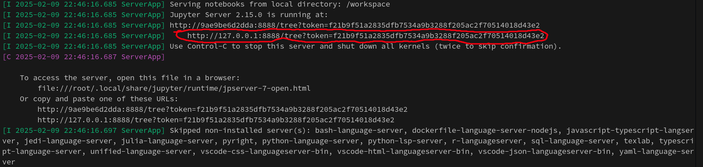

# Python Setup Guide

This setup guide provides instructions to quickly get started with the AI Pool using a virtual environment (`venv`), `pip` and a `requirements.txt` file, or, as an alternative option, Docker.

## Requirements
- Python 3.x and `pip` installed on your machine (for venv setup).
- Docker installed on your machine (for Docker setup).

## Option 1: Local Setup with Virtual Environment

If you want to set up the environment locally on your machine, you can use a Python virtual environment (`venv`).

### 1. Create and Activate the Virtual Environment

Navigate to your project directory and create a new virtual environment:

```bash
python3 -m venv poc_ai_pool_venv
```

Activate the virtual environment:

- On **macOS/Linux**:

    ```bash
    source poc_ai_pool_venv/bin/activate
    ```

- On **Windows**:

    ```bash
    poc_ai_pool_venv\Scripts\activate
    ```

### 2. Install Required Packages

Ensure that you have a `requirements.txt` file in your project directory, containing all the necessary dependencies for the pool.

To install the required packages listed in the `requirements.txt`, run:

```bash
pip install -r requirements.txt
```

## Classic error with vscode

- **Virtual Environment is activated in your terminal, but not on your vscode**
  - Ensure that the virtual environment is properly activated by checking the bottom right of your status bar.


## Option 2: Docker Setup

### 1. Pull the Docker Image

To begin, pull the pre-built Docker image that contains the necessary setup for the pool. Run the following command in your terminal:

```bash
docker pull laiheau/poc_ai_pool
```

### 2. Run the Docker Container

Once the image is pulled, you can start a Docker container that will run the environment. Execute this command:

```bash
docker run -t -i -v .:/workspace:z -p 8888:8888 laiheau/poc_ai_pool
```

This will start a jupyter notebook server, **and copy your current directory in it**. You read this right, your current directory will be synchronized each seconds with the one in your jupyter notebook server. Then, you just need to follow the link in your terminal (see the picture bellow).



## Conclusion

You now have two options for setting up the Poc AI Pool environment: using a local Python virtual environment or Docker. Both methods will give you access to Jupyter Notebooks and all the tools needed for the pool. Enjoy this week with us !
