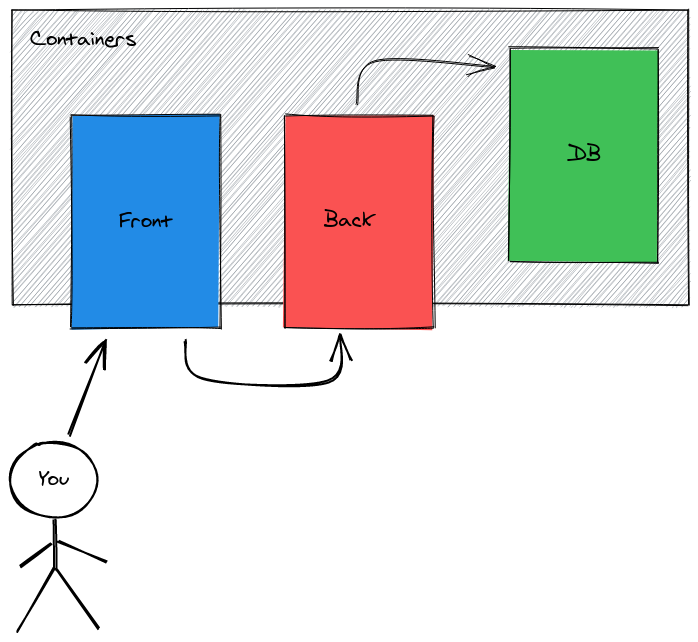

# PoC Software Pool 2025 - Day 04 - Docker

**Day purposes**

✔️ Understand DevOps interests.

✔️ Learn the basics of Docker.

✔️ Create a simple image.

✔️ Deploy a complete stack with `docker compose`.

## Introduction

When it's time to deploy an application, you will face various problems:
- How scale on various servers?
- How build your app for several architectures?
- How manage dependencies and linked services that work with your app?

For instance, if you want to deploy a simple application composed of a web 
server, a frontend and a database, you will need to install all the
required dependencies in the server, maybe update root config and create
system services to automatically restart it on fail, manage volumes and so on...

You've understood it, manually manage a stack is complex and painful.<br>
This is why Docker exist, with it, you can easily package your application
into containers that you can manage independently or together.

This dynamic follows the way of [DevOps](https://aws.amazon.com/devops/what-is-devops/),
it's a philosophy and set of practices to improve the delivery process from
build to release and monitoring.

Here's a simple schema of the devops workflow:


This subject is focused on docker and containers building & management. It's
one of the most important part of DevOps.

## Step 0 - Setup

Please refer to the [SETUP.md](./SETUP.md) file.

## Step 1 - Dockerfile

Dockerfile is the first piece to containerize your application.<br>
The purpose is to create an image of your application to make it easily
deployable 😃

This will help you to avoid installing the application directly on the
computer and having dependencies issues.<br>
With an image, you can't have any of these problems, it's self deployable and
everything is already installed in it, you just have to run it with
`docker run <image>`.

Let's create an image of the API you made yesterday 🚀

First, in your pool repository, in the folder `day04`, create a folder `docker`.

```shell
mkdir -p day04/docker
```

Now you can create a directory `step1`, copy-paste yesterday API
sources and create a file [`Dockerfile`](https://docs.docker.com/engine/reference/builder/).

Your `Dockerfile` must execute the following set:
- Pull the latest [`alpine`](https://nickjanetakis.com/blog/the-3-biggest-wins-when-using-alpine-as-a-base-docker-image)
image of your language.
- [Expose](https://docs.docker.com/engine/reference/builder/#expose) port `8080`
- Install dependencies
- Set the [environment variable](https://docs.docker.com/engine/reference/builder/#env)
`HELLO_MESSAGE` to `docker`
- Build the API
- Set the entrypoint to start the server when running the image.

> ⚠️ Be careful to the listening API host.

> Take a look at those [good practices](https://docs.docker.com/develop/develop-images/dockerfile_best-practices/) 😉

## Step 2 - Docker compose

In the previous step, you saw how to put your application in a container,
it's time to go further: you will manage multiple containers with
[docker compose](https://docs.docker.com/compose/).

Create a directory `step2`:

```shell
mkdir -p step2
```

The purpose is to manage a fullstack application within containers.<br>
This [application](./resources) is composed of:
- a [MongoDB database](https://www.mongodb.com/) (to run in a container)
- a [Express](https://expressjs.com/) API
- a [React](https://reactjs.org) web application

Here's a simple schema of the application architecture:



### Lay the foundations

In the directory `step2`, copy the [ressources](./resources/FullStackApp/) files.

You should end up with the following architecture:

```shell
tree -d
# .
# ├── Server (backend)
# │   ├── Models
# │   ├── index.js
# │   └── Dockerfile (to complete)
# └── ToDoList (frontend)
#     ├── index.html
#     ├── public
#     ├── Dockerfile (to complete)
#     ├── vite.config.js
#     └── src
#         ├── components
#         ├── App.jsx
#         ├── main.jsx
#         ├── app.scss
#         └── index.scss
#
```

### Dockerfiles

As you may notice, the `Dockerfile` in `frontend` or `backend` project are not complete.<br>
You figured out, you will need to fill them.<br>
In each directory, complete the `Dockerfile` and write a set of instructions to
make it work.

> 💡 You will need to test and understand how each program work to containerize it.<br>
> Google is also your best friend, as a DevOps engineer it's common to
> work on multiple stack without necessarily being an expert on them.

### Compose

[Docker compose](https://docs.docker.com/compose/compose-file/) aims to
orchestrate services. It will help you a lot when you need to deploy
multiple [microservices](https://aws.amazon.com/microservices/).

Your `docker-compose` file must be composed of:

3 services:
- backend: run the `backend` image
- frontend: run the `frontend` image
- database: run the `postgres` image

1 network:
- backend: link database & backend in a private network

1 volume:
- db-data: store database permanent data

To complete this step, you'll need to use all the knowledge acquired during
previous day. It will be important to set an environment to correctly
configure the database, backend and frontend in the `docker-compose`.

> Don't forget to exposed ports and link your services 😄

> This step is voluntarily complex to make you search and understand
> by yourself, this is what real DevOps engineers do 🚀

## Additional resources

- [Optimize your Dockerfile](https://medium.com/@tonistiigi/faster-multi-platform-builds-dockerfile-cross-compilation-guide-part-1-ec087c719eaf)
- [Buildkit, the future of docker build](https://github.com/moby/buildkit)
- [Scale to the moon with Kubernetes](https://kubernetes.io)
- [Create a Swarm of container with DockerSwarm](https://docs.docker.com/engine/swarm/)
- [Improve your stack deployment with Helm](https://helm.sh)
- [A GUI to manage your container: LazyDocker](https://github.com/jesseduffield/lazydocker)
- [Infra as code with Terraform](https://registry.terraform.io)

<h2 align=center>
Organization
</h2>
<br/>
<p align='center'>
    <a href="https://www.linkedin.com/company/pocinnovation/mycompany/">
        
    </a>
    <a href="https://www.instagram.com/pocinnovation/">
        
    </a>
    <a href="https://twitter.com/PoCInnovation">
        
    </a>
    <a href="https://discord.com/invite/Yqq2ADGDS7">
        
    </a>
</p>
<p align=center>
    <a href="https://www.poc-innovation.fr/">
        
    </a>
</p>

> 🚀 Don't hesitate to follow us on our different networks, and put a star 🌟 on `PoC's` repositories.
